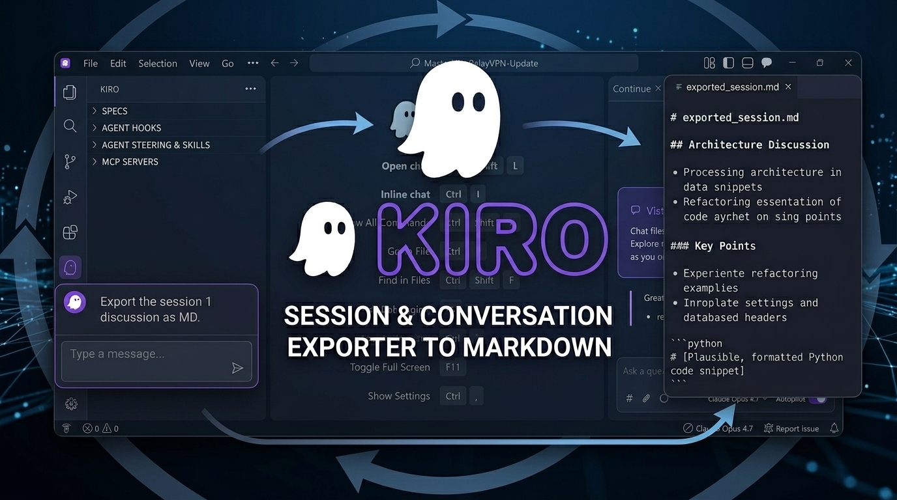

<div align="center">
  
</div>

# Kiro Session & Conversation Export ⚡️

[](https://opensource.org/licenses/Apache-2.0)
[](https://www.python.org/)
[](https://github.com/MeXenon/kiro-session-export)

**The ultimate, terminal-native export pipeline for Kiro IDE sessions.**

If you find this tool useful, **please consider leaving a ⭐️ on this repository!** It helps others find the project.

---

## 🛑 The Problem

Kiro currently has **no built-in way to copy, export, or review your conversations and sessions.** You can't even copy your own messages out of the chat panel.

On top of that, when your context window fills up, Kiro silently **compacts the conversation into a summary and moves to a new session** — you have zero control over this process. For heavy-duty, multi-step workflows this means:

- **You lose access to earlier context.** Once compaction fires, the original conversation is gone from the active window. There's no "scroll up" to find what happened 50 turns ago.
- **You can't feed sessions into another AI** for debugging, code review, or analysis.
- **You can't extract terminal commands** to create automated scripts from what the agent ran.
- **You can't read the agent's hidden reasoning,** sub-agent calls, or internal decision traces.
- **You can't trace the full lineage** of a conversation that was split across multiple compacted sessions.

The raw session data *does* exist on disk, but it's buried across dozens of JSON files in deeply nested storage directories, making it essentially impossible to read manually.

## 💡 The Solution

**Kiro Session Manager** (`kiro-md.py`) is designed for maximum flexibility. It parses Kiro's local session storage — including workspace session indices, shell histories, and execution records — and provides a beautiful, interactive, fullscreen terminal UI (TUI) to dynamically filter exactly what you want to export into clean Markdown.

Because it's a pure Python CLI tool, it's completely **portable**. You can use it locally on your laptop, or run it headlessly on a remote machine. It is 100% compatible with Kiro IDE on Windows, macOS, and Linux.

---

## ✨ Features

- **21 Filterable Sections:** Toggle everything from User/Agent messages to hidden agent reasoning, terminal commands, MCP tool calls, sub-agent invocations, web searches, diagnostics, and more.
- **Compaction Chain Tracking:** Automatically detects and links sessions that flowed from each other via context compaction. View sessions in chain-grouped mode with authoritative `parentSessionIds` ancestry and heuristic fallback linking.
- **Parallel Exports:** Select and process multiple sessions at the same time. The filter shows combined line counts and exports them simultaneously.
- **Dynamic Output Capping:** Terminal payloads can be hundreds of thousands of lines long. Instantly cap output blocks to exactly 1, 5, 8, 10, or up to 500 lines to keep your context windows lean.
- **Granular Message Filtering:** Independently control how many of the last N blocks you want from each message type — 👤 User, 🤖 Agent, 🧠 Reasoning, and ✂️ Compaction Summary — all separately adjustable with `◀`/`▶`.
- **Last N Turns:** Don't need the full session? Select only the most recent N turns to export. A "turn" is one user message plus all the agent work that followed.
- **Live Context:** Want to see *exactly* what the LLM was seeing? The "Live Context" option replicates Kiro's own compaction logic — every summarization block clears prior items, giving you the strict active memory window.
- **"Clean Chat" Mode:** Instantly strips messy IDE background data, active-file streams, and open-tab XML that Kiro silently attaches to prompts, leaving just your actual words.
- **7 Built-in Presets:** Jump straight to "Chat Only", "Chat + Reasoning", "Chat + Terminal", "Code Activity", "Outputs Only", or "Full Export" with a single keystroke.
- **Real-Time Context Math:** See exactly how many lines you are selecting *before* you export, complete with a live progress bar.
- **Chain Merge Export:** Export an entire compaction chain as one unified Markdown document, with session dividers and lineage annotations.
- **Multi-Workspace Support:** Automatically detects all Kiro workspaces, with smart cwd-based auto-selection and one-keystroke workspace switching.
- **Execution Record Indexing:** Indexes every execution record under `KIRO_HOME` using parallel IO and single-pass regex extraction — no full JSON parse needed for metadata.

---

## 🛠 Usage

No complex dependencies. Just download and run the script using Python.

### 🚀 Quick Start (One-Liner)
Run the software instantly without manually cloning the repo:

**🐧 Linux / 🍎 macOS:**
```bash
curl -sO https://raw.githubusercontent.com/MeXenon/kiro-session-export/main/kiro-md.py && python3 kiro-md.py
```

**🪟 Windows — Command Prompt:**
```cmd
curl -sO https://raw.githubusercontent.com/MeXenon/kiro-session-export/main/kiro-md.py && python kiro-md.py
```

**🪟 Windows — PowerShell 7:**
```powershell
Invoke-WebRequest -Uri "https://raw.githubusercontent.com/MeXenon/kiro-session-export/main/kiro-md.py" -OutFile "kiro-md.py"; python kiro-md.py
```

### 💻 Manual Run
If you prefer to download or clone the file manually:

**Linux / macOS:**
```bash
python3 kiro-md.py
```

**Windows:**
```cmd
python kiro-md.py
```

> **Tip:** For faster JSON parsing on large sessions, install `orjson` (`pip install orjson`). The script auto-detects it and falls back to stdlib `json` seamlessly.

### The Interface

1. **Select a workspace:** The script automatically scans Kiro's `globalStorage` and presents your workspaces sorted by recent activity. It auto-selects the workspace matching your current working directory.
2. **Browse sessions:** A rich table view shows every session with date, title, compaction chain membership, badges (↻ from compaction, ↪ continued, hidden), preview text, and file size.
3. **Choose extraction scope:**
   * **[F] Full Session** — Export all turns (default).
   * **[L] Last N Turns** — Enter a number and only the most recent N turns are included.
   * **[C] Live Context** — Replicates Kiro's compaction logic to extract the strict active context window.
4. **Filter & Refine:** 
   * `↑` / `↓` - Navigate the filter list
   * `Enter` / `Space` - Toggle a section ON/OFF
   * `◀` / `▶` on **📤 Terminal Output Cap** - Adjust max lines per output block
   * `◀` / `▶` on **👤 User Message Cap** - Keep only the last N user messages
   * `◀` / `▶` on **🤖 Agent Message Cap** - Keep only the last N agent responses
   * `◀` / `▶` on **🧠 Reasoning Cap** - Keep only the last N reasoning blocks
   * `◀` / `▶` on **✂️ Compaction Summary Cap** - Keep only the last N summaries
   * `1`-`7` - Load presets
5. **Export Destination:** Press `Q` when you're ready:
   * **[F]ile:** Save directly to a `.md` file in the current directory (Default).
   * **[C]lipboard:** Instantly copy the raw Markdown so you can paste it straight into ChatGPT or Claude.
   * **[B]oth:** Save to disk *and* copy to clipboard simultaneously.

---

## 📂 Kiro Storage Layout

For reference, this is the internal storage structure that `kiro-md.py` navigates:

```
%APPDATA%/Kiro/User/globalStorage/kiro.kiroagent/
├── workspace-sessions/<urlsafe-b64 workspace-path>/
│   ├── sessions.json              ← per-workspace session index
│   └── <sessionId>.json           ← session shell (user msgs + stubs)
└── <workspace-hash>/<bucket>/<execution-hash>   ← execution records
```

Execution records hold the actual tool calls, assistant `say` messages, reasoning, summarizations (compaction), errors, and everything else the agent did during a session.

---

## 📦 Supported Sections

| Emoji | Section | Default | Description |
|-------|---------|---------|-------------|
| 👤 | User Messages | ✅ | Your prompts and requests |
| 🤖 | Agent Messages | ✅ | Kiro's responses |
| 🧠 | Agent Reasoning | ❌ | Internal reasoning traces |
| 📖 | File Reads | ❌ | Files the agent inspected |
| 🆕 | File Creates | ✅ | New files created |
| ✏️ | File Edits | ✅ | Modifications to existing files |
| 🗑️ | File Deletes | ✅ | Deleted files |
| 💻 | Terminal Commands | ✅ | Commands executed |
| 📤 | Terminal Outputs | ✅ | Command results |
| ⚙️ | Process Control | ✅ | Background processes |
| 🔎 | Code Search | ❌ | Search queries and results |
| 🩺 | Diagnostics | ❌ | IDE diagnostics |
| 🌐 | Web Searches | ❌ | Web search queries |
| 🔗 | Web Fetches | ❌ | URL content fetches |
| 🔌 | MCP Calls | ❌ | Model Context Protocol tool calls |
| 🧩 | Sub-Agent Calls | ✅ | Delegated sub-agent invocations |
| ✂️ | Compaction Summary | ✅ | Context compaction summaries |
| 🎯 | Intent Classification | ❌ | Intent detection results |
| ❗ | Errors | ❌ | Error messages |
| ❓ | Clarifying Q&A | ❌ | Agent's clarification questions |
| 🔔 | Session Events | ✅ | Lifecycle events |
| 📝 | Session Metadata | ✅ | Session configuration details |

---

## 📈 Activity & Growth

[](https://star-history.com/#mexenon/kiro-session-export&Date)

---

## 🔗 Related Projects

Looking for the same tool but for OpenAI Codex? Check out **[codex-session-export](https://github.com/MeXenon/codex-session-export)**.

---

### Compatibility

> **Tested on:** Kiro IDE (desktop application).  
> **Not tested on:** Kiro CLI. The CLI may use a different storage layout. If you try it and it works (or doesn't), please open an issue!

---

### Why build this?

When pushing AI to its limits, the conversation log becomes your most valuable codebase asset. This tool guarantees you have complete ownership, visibility, and control over that data.

*If this tool saved your context window (or your sanity), **please give it a ⭐️!***
